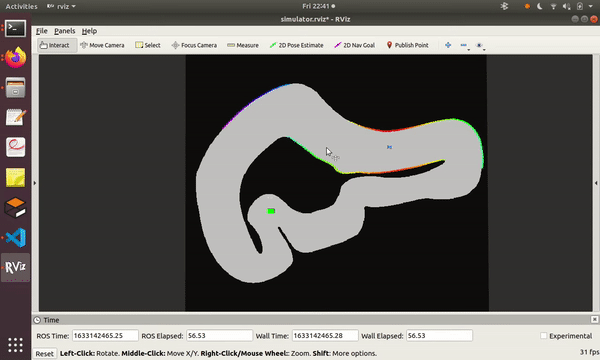

# Artificial-Potential-Field-for-autonomous-vehicle
A version of the artificial potential field algorithm for a non-holonomic car like like robots is presented here. The ros node for the algorithm is provided. The code is implemented to work with the F1tenth simulator.  Please refer to the short report pdf for details. 
The idea and images are taken from the paper [[1]](#1)  
Tuning insights and methodology, and video of implementation on F1tenth vehicle will be added soon.
## SUMMARY
__This algorithm provides a way to track an existing path generated by another planning algorithm like A* or RRTs, while avoiding obstacles that were unknown earlier at the path planning
stage. Thus the artificial potential field algorithm allows us to merge the tracking component
and the reactive component of driving a vehicle in a real environment. We use the analogy
of charged particles and potential fields and the forces they exert on charged particles. We
assume that the car and the obstacles are similarly charged and thus repel each other, and the
goal and sub-goal points are oppositely charged from that of the car and thus attract it towards
them. Subsequently, the obstacles’ repelling forces and the goals attracting forces result in
motion of the car from start to goal while avoiding the obstacles.__

   

## References
<a id="1">[1]</a> Kim, Dong-hyung & Han, Chang-Soo & Lee, ji. (2013). Sensor-based motion planning for path tracking and obstacle avoidance of robotic vehicles with nonholonomic constraints. Proceedings of the Institution of Mechanical Engineers, Part C: Journal of Mechanical Engineering Science. 227. 178-191. 10.1177/0954406212446900. 
